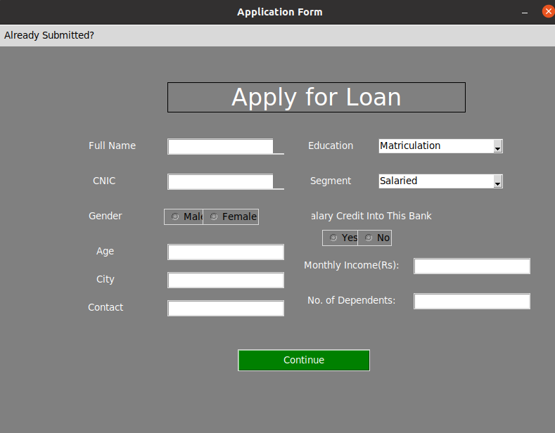
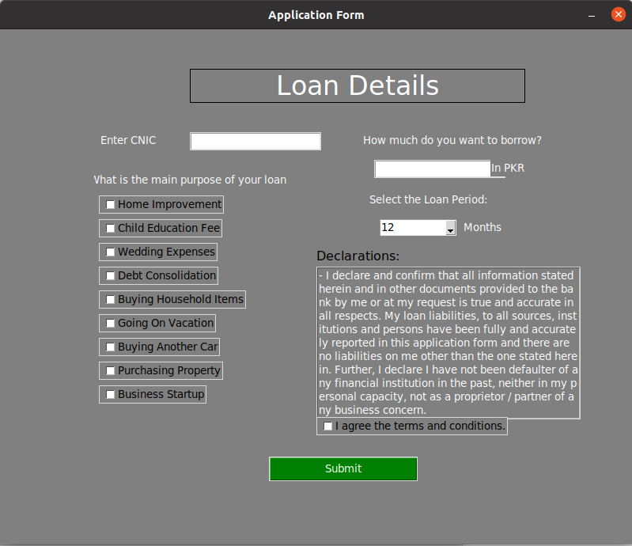
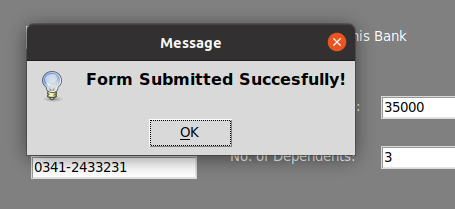
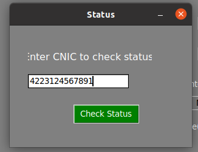
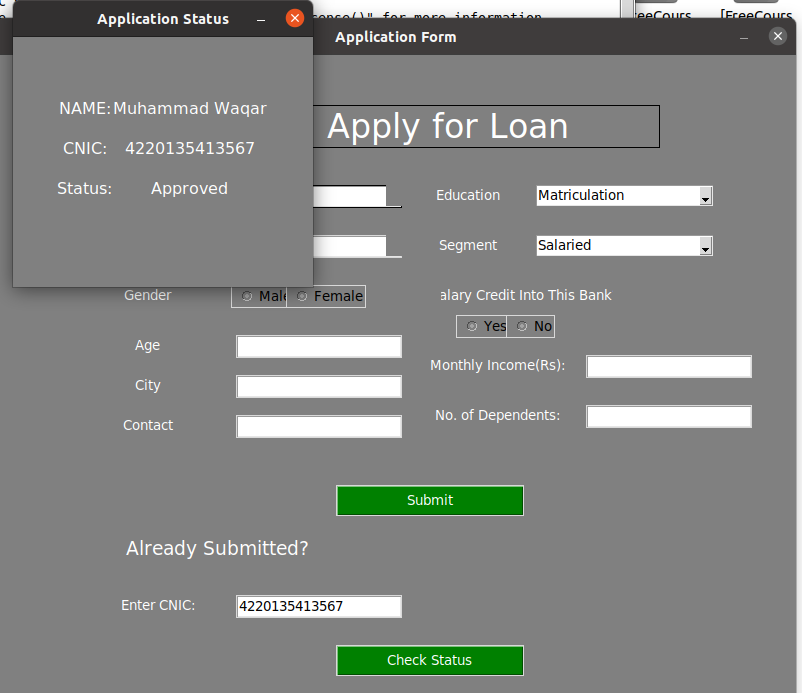

# Loan-Predictor
This project is made for predicting that you are eligible to take/request loan or not.

Based on the information inserted in the form it will allow you to move to next step after processing your eligibility. Then it will tell you whether the system has approved your loan approval or not.
<h3>GUI is designed Using Tkinter library Python3.</h3>

  

    
Screen Shots of How GUI will look.

  

  
  
  
Form Submition Window.

  
   
For checking status.

  
  
After retrieving user using cnic you can check status.

  

